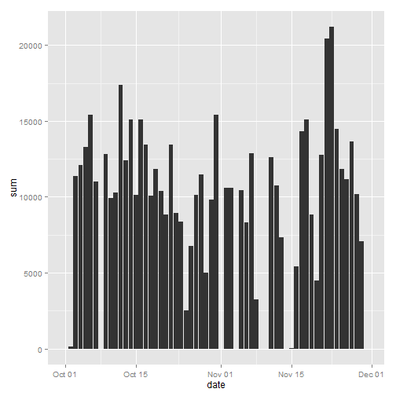
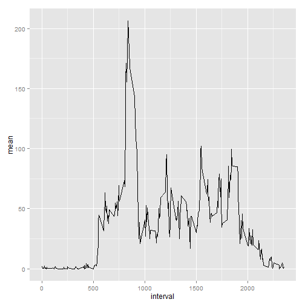
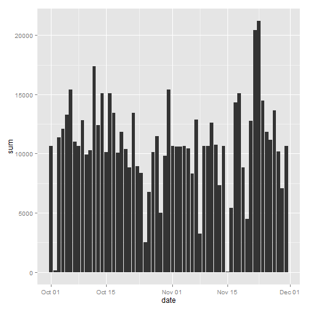
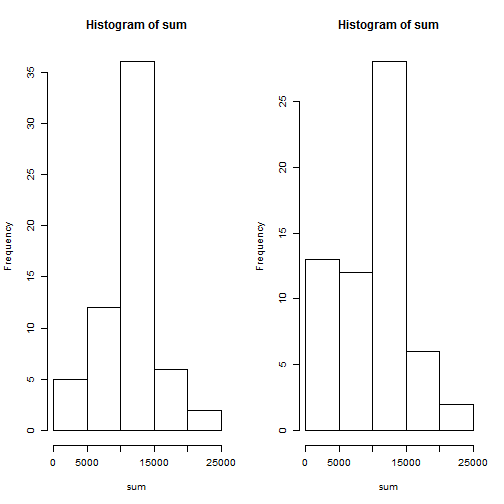

## Loading and preprocessing the data

1. read the data from downloaded CSV file

```r
dd <- read.csv("activity.csv", header=T, stringsAsFactors=F)
```
How does the data look like?

```r
str(dd)
```

```
## 'data.frame':	17568 obs. of  3 variables:
##  $ steps   : int  NA NA NA NA NA NA NA NA NA NA ...
##  $ date    : chr  "2012-10-01" "2012-10-01" "2012-10-01" "2012-10-01" ...
##  $ interval: int  0 5 10 15 20 25 30 35 40 45 ...
```

2, It would be good to have the date as "Date" data type

```r
dd$date <- as.Date(dd$date)
```
Now, how does the data look like?

```r
str(dd)
```

```
## 'data.frame':	17568 obs. of  3 variables:
##  $ steps   : int  NA NA NA NA NA NA NA NA NA NA ...
##  $ date    : Date, format: "2012-10-01" "2012-10-01" ...
##  $ interval: int  0 5 10 15 20 25 30 35 40 45 ...
```
**Attention**: interval (:int) is **NOT** a rigid continue sequence number.
Instead, it is combination of hour number and minute number without leading **0**s


## What is mean total number of steps taken per day?
1. preparing the mean steps for each day, with NA value ripped off

```r
library(plyr)  
dsum <- ddply(dd,.(date), summarize, sum=sum(steps, na.rm=T) )  
dsum$date <- as.Date(as.character(dsum$date))
```
How does the data look like?

```r
str(dsum)
```

```
## 'data.frame':	61 obs. of  2 variables:
##  $ date: Date, format: "2012-10-01" "2012-10-02" ...
##  $ sum : int  0 126 11352 12116 13294 15420 11015 0 12811 9900 ...
```

2. make the histogram chart

```r
library(ggplot2)
qplot(x=date, y=sum, data=dsum, geom="bar", stat="identity")
```

 

3. repare the mean and median data and report them

```r
mean <- mean(dsum$sum)
med <- median(dsum$sum)
```
The **mean** value of total steps per day is 9354.2295082.  
The **median** value of total steps per day is 10395.


## What is the average daily activity pattern?
1. the time series plot for 5 minutes interval mean steps cross all days, with NA values ripped off

```r
dint <- ddply(dd, .(interval), summarize, mean=mean(steps, na.rm=T))
qplot(x=interval, y=mean, data=dint,geom="line")
```

 

######2. Which 5 minute interval has the maximum averaged steps?

```r
Intv <- dint[dint$mean==max(dint$mean), "interval"]
itvstr <- substr(10000+Intv, 2, 5)
Time <- paste(substr(itvstr, 1, 2), substr(itvstr, 3, 4), sep=":") 
```
The 5 minute interval at 08:35 have the maximum averaged steps over all days.


## Imputing missing values
1. The total number of rows with **"NA"** values

```r
sum <- sum(is.na(dd$steps))
```
and NA happens on 

```r
library(lubridate)
dlist <- as.data.frame(unique(dd[is.na(dd$steps), "date"]))
names(dlist) <- "date"
dlist$weekday <- wday(dlist$date)
dlist
```

```
##         date weekday
## 1 2012-10-01       2
## 2 2012-10-08       2
## 3 2012-11-01       5
## 4 2012-11-04       1
## 5 2012-11-09       6
## 6 2012-11-10       7
## 7 2012-11-14       4
## 8 2012-11-30       6
```

for each day, NA values populate the whole day

```r
ddply(dd[dd$date %in% dlist$date, ], .(date), summarize, 
      na.count=sum(is.na(steps)), 
      v.count=sum(!is.na(steps)) )
```

```
##         date na.count v.count
## 1 2012-10-01      288       0
## 2 2012-10-08      288       0
## 3 2012-11-01      288       0
## 4 2012-11-04      288       0
## 5 2012-11-09      288       0
## 6 2012-11-10      288       0
## 7 2012-11-14      288       0
## 8 2012-11-30      288       0
```
so a simple strategy is to fill the value by whole day.


2, filling with average of the same week days

simple fill the NA value with the overall means

```r
ddfix <- dd
sum(is.na(ddfix[dd$date %in% dlist$date, "steps"]))
```

```
## [1] 2304
```

```r
ddfix[dd$date %in% dlist$date, "steps"] <- as.integer(dint[, "mean"])
sum(is.na(ddfix[dd$date %in% dlist$date, "steps"]))
```

```
## [1] 0
```

making a histogram 

```r
dsum1 <- ddply(ddfix,.(date), summarize, sum=sum(steps, na.rm=T) )  
dsum1$date <- as.Date(as.character(dsum1$date))
qplot(x=date, y=sum, data=dsum1, geom="bar", stat="identity")
```

 


```r
mean1 <- mean(dsum1$sum)
med1 <- median(dsum1$sum)

mean <- mean(dsum1$sum)
median <- median(dsum1$sum)

dmean <- mean-mean1
dmed <- median-med1
```

Before filling NA values, mean = 1.074977 &times; 10<sup>4</sup>, media = 10641
after filling NA values, mean= 1.074977 &times; 10<sup>4</sup>, media = 10641
the impact of filling NA values on mean is 0, on median is 0

4. the difference of filling in NA values is


```r
par(mfrow=c(1,2), cex=0.8)
with(dsum1, hist(sum))

with(dsum, hist(sum))
```

 


## Are there differences in activity patterns between weekdays and weekends?


```r
library(lattice)
ddfix$weekday <- weekdays(ddfix[,"date"])
ddfix$wd_cd <- "weekday"
ddfix[ddfix$weekday %in% c("Sunday", "Saturday"), "wd_cd"] <- "weekend"

dintd <- ddply(ddfix[ddfix$wk_cd=="weekday", ], .(interval), 
               summarize, mean=mean(steps, na.rm=T))
dinte <- ddply(ddfix[ddfix$wk_cd == "weekend", ], .(interval), 
               summarize, mean=mean(steps, na.rm=T))
```


